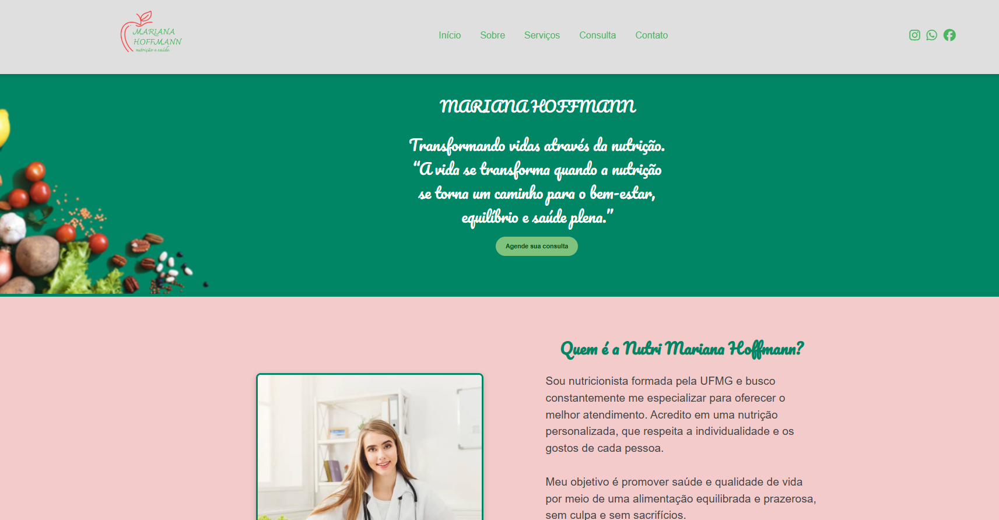

<h1 align="center" style="font-weight: bold;">Nutri Mariana Hoffmann 🥦</h1>

<p align="center">
 <a href="#sobre">Sobre</a> • 
 <a href="#funcionalidades">Funcionalidades</a> • 
 <a href="#tecnologias">Tecnologias</a> • 
 <a href="#como-rodar">Como Rodar</a> • 
 <a href="#preview">Preview</a>
</p>

<p align="center">
    <b>Site institucional da Nutricionista Mariana Hoffmann, desenvolvido em HTML, CSS e JavaScript, com foco em um design leve, acolhedor e totalmente responsivo. O projeto apresenta informações sobre consultas, formas de pagamento, dúvidas frequentes e links para redes sociais.</b>
</p>

---

<h2 id="sobre">📋 Sobre o Projeto</h2>

O **Nutri Mariana Hoffmann** é um site institucional criado para apresentar os serviços da nutricionista, transmitindo **credibilidade e acolhimento** aos visitantes.  

O layout foi pensado para oferecer uma **experiência agradável**, com cores suaves e navegação fluida, garantindo que o conteúdo seja facilmente acessível tanto em **dispositivos móveis quanto desktops**.  

Este projeto visa praticar conceitos de **HTML semântico**, **CSS responsivo** e **JavaScript interativo**, simulando um site profissional real de apresentação pessoal.


SITE HOSPEDADO: https://nutri-mari-hoffmann.vercel.app
---

<h2 id="funcionalidades">🚀 Funcionalidades Principais</h2>

- 👩‍⚕️ **Apresentação profissional** da nutricionista  
- 📅 **Informações sobre consultas** e formas de atendimento  
- 💳 **Formas de pagamento** destacadas com clareza  
- ❓ **Sessão de dúvidas frequentes (FAQ)**  
- 📱 **Layout totalmente responsivo**, adaptado para celulares e tablets  
- 🔗 **Links diretos para redes sociais e contato**  
- 🎨 **Design leve, acolhedor e moderno**

---

<h2 id="tecnologias">💻 Tecnologias Utilizadas</h2>

<div>
  
  <span>HTML5</span>
</div>
<div>
  
  <span>CSS3</span>
</div>
<div>
  
  <span>JavaScript</span>
</div>

---

<h2 id="como-rodar">🚀 Como Rodar o Projeto</h2>

1️⃣ **Clone o repositório**
```bash
git clone https://github.com/Dieegoo13/Nutri-MariHoffmann.git
````
<h2 id="preview">📸 Preview do Projeto</h2>



